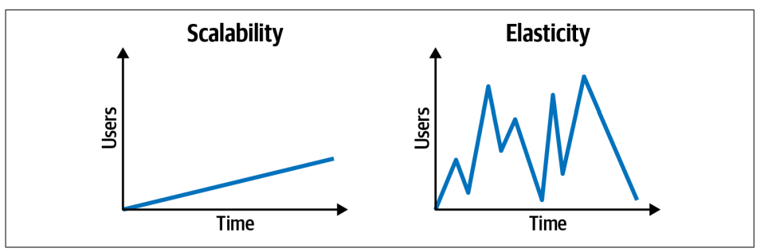

# Software engeneering concepts
## 🔗 Syllabus
- [System Design](#system-design)
- [OOP, SOLID, DDD, Clean Code](#oop-solid-ddd-clean-code)
- [JavaScript / TypeScript](#javascript--typescript)
- [SQL](#sql)

---
# System design 
System Design is all about planning how different parts of a system work together to handle scalability, performance, reliability, and maintainability.

## Synchronous vs Asynchronous

#### 5 years old explanation

Synchronous is like waiting in line for ice cream. You have to wait for the person in front of you to finish before you can get yours.

Asynchronous is like ordering a pizza. You call and place your order, but while waiting for the pizza to arrive, you can play, watch TV, or do something else. When it's ready, they bring it to you.

### Synchronous:

Synchronous operations happen one after another, in a blocking manner. Each task must complete before the next one begins. This is common in sequential programming where each step depends on the previous step finishing.

### Asynchronous:

Asynchronous operations allow tasks to happen independently and not block the execution of the program. Instead of waiting, the program can continue running other tasks while waiting for the operation to complete.

### Trade-offs Between Synchronous and Asynchronous

| **Factor**          | **Synchronous**                                               | **Asynchronous**                                                                         |
| ------------------- | ------------------------------------------------------------- | ---------------------------------------------------------------------------------------- |
| **Execution Order** | Tasks run sequentially, one after another.                    | Tasks can run independently without waiting.                                             |
| **Performance**     | Slower for tasks that involve waiting (e.g., I/O operations). | More efficient for handling multiple tasks concurrently.                                 |
| **Complexity**      | Easier to understand and debug.                               | More complex due to callbacks, promises, and concurrency issues.                         |
| **Blocking**        | Blocks execution until a task is completed.                   | Does not block; other tasks can continue running.                                        |
| **Error Handling**  | Errors are handled sequentially, making debugging simpler.    | Requires handling multiple possible execution paths (e.g., promise chains, async/await). |
| **Use Case**        | Best for tasks that must happen in order, like calculations.  | Best for tasks like API calls, file I/O, or user interactions.                           |
| **Resource Usage**  | Can lead to inefficiency if waiting on slow operations.       | Uses resources efficiently by not blocking the main thread.                              |
| **Scalability**     | Harder to scale due to blocking nature.                       | More scalable, especially for high-load applications.                                    |

## Orchestrated vs Coordination

#### 5 years old explanation

Orchestrated is like a conductor leading an orchestra. The conductor tells each musician when to play so that everything happens in a structured way.

Coordination is like a group of friends playing music together without a conductor. They listen to each other and adjust as they go, but no one is in complete control.

### Orchestrated:

In an orchestrated system, there is a central authority that controls and directs the flow of tasks. Each component follows predefined instructions, much like musicians following a conductor. This approach ensures a structured, predictable sequence of actions.

- example: aws step function

### Coordination:

In a coordinated system, components work together without a central authority dictating their actions. Each part is aware of others and adjusts dynamically based on communication and shared state.

- Orchestration a central service controls the work flow, it easy to track workflows but adds a single point of control (and potential failure).
- Choreography Services react to events and determine their next step independently (like event-driven architectures) scales better and reduces dependencies but can become chaotic without clear event contracts.

## Elasticity vs Escalability

- Escalability how much the service can handle simultaneos users.
- Elasticity how much it can handle an explosion of users
  

## Static coupling vs Dynamic coupling

static coupling describes how services are wired together _compilation phase_, whereas dynamic coupling
describes how services call one another at runtime.
it is important to know that a database an SQS queue are static coupling components, when we call the SQS that is a dynamic coupling

## CAP Theorem (Consistency, Availability, Partition Tolerance)

- **Consistency** means all nodes in a distributed system see the same data at the same time.
- **Availability** means every request gets a response, even if some of the data might not be up-to-date.
- **Partition Tolerance** ensures the system continues to function even if network partitions occur between nodes.

## ACID vs BASE (CAP Theorem related)

- **ACID** refers to the properties (Atomicity, Consistency, Isolation, Durability) of traditional databases ensuring reliable transactions.
- **BASE** (Basically Available, Soft state, Eventually consistent) is a model used in NoSQL systems where availability is prioritized over consistency.

## Blue/Green Deployment vs Canary Deployment

### **Blue/Green Deployment**

involves running two environments (blue and green) and switching traffic between them to minimize downtime during updates.

- When minimal downtime is critical.
- Major application updates requiring a quick rollback.
- Ensuring a stable environment before switching traffic.

### **Canary Deployment**

gradually rolls out changes to a small subset of users before deploying to everyone, allowing for early detection of issues.

- When testing updates with real users but in a controlled manner.
- When monitoring performance and errors in a production-like environment.
- When reducing risk of major failures with incremental rollout.

## Monolithic Event-Driven and Microservices Event-Driven:

- Monolithic Event-Driven: Inside a monolith, you can implement event-driven behavior to reduce tight coupling, making your app more scalable, though it's still running as a single process.
- Microservices Event-Driven: In microservices, each service is independent and communicates through events, enabling decoupling and better scalability across machines or containers.

## Reliability, Fault Tolerance, and Redundancy:

- Reliability: the system's ability to perform its intended functions without failure or errors over a specified period of time.
- Fault Tolerance: refers to how well the system can detect and heal itself from a problem, i.e. disable a function, revert to a different mode, switch to a different server.
- Redundancy: This redundancy is provided by our backup server which essentially "shadows" the contents of a server. We don't need this server, but it only comes into play if our primary server fails. Only by having this redundancy, are we able to have fault tolerance. In this case, the second server is simply a backup. But, what if we had two servers that were both active? This would be called active-active redundancy.

## Throughput and Latency:

- Throughput: refers to the amount of data or operations we can handle over some period of time. The throughput of a client making requests to a server would be measured through the number of requests per second, Database(queries/second),Network(bytes/second).
- Latency: refers to the delay between the client making the request and the server responding to that request.

## The Open Graph Protocol (OGP):

By embedding specific meta tags in the <head> of an HTML document, you can control how your content appears when shared on platforms like Facebook, LinkedIn, Twitter (with some differences), and others.

#### Example:

```html
<meta property="og:title" content="My Awesome Website" />
<meta
  property="og:description"
  content="This is a description of my awesome website."
/>
<meta property="og:image" content="https://example.com/image.jpg" />
<meta property="og:url" content="https://example.com" />
<meta property="og:type" content="website" />
<meta property="og:site_name" content="MySite" />
```

## Compiled vs interpreted languages:

#### 5 years old explanation

Imagine you're reading a storybook. In one case, the story is written in a special way that the book is turned into a picture book, and you can read it right away—like magic! This is similar to a compiled language. Before you can play with it, someone (a compiler) reads the whole book and turns it into something you can use directly.

In another case, you have a person reading the story to you one page at a time. Each time you want to hear a part of the story, the reader (the interpreter) reads it aloud to you, page by page, without turning the whole book into something you can read on your own. This is like an interpreted language. It reads and understands the story one part at a time while you play with it!

## TCP vs UDP

#### 5 years old explanation

Imagine you are sending letters to your friend:

- TCP (Like sending a letter with tracking)
  When you send a letter, you make sure your friend gets it. If the letter gets lost, you send it again. Your friend also tells you, "Hey, I got your letter!" so you know it arrived safely. This is like TCP—it makes sure all messages are delivered in the right order and without mistakes.
- UDP (Like throwing paper airplanes)
  Instead of mailing a letter, you throw paper airplanes with messages. Some might land perfectly, but others might get lost or crumpled. You don’t wait for your friend to say, "I got it!" You just keep throwing. This is like UDP—it's super fast, but messages might get lost.

### TCP

- It sends the data _IN ORDER_
- Ensures delivery, if a packet fails it resends it
- slower
- HTTP, WS, SMTP

### UDP

- Not Reliabile
- Not in order
- ALOT faster
- streaming data, gaming

## Optimistic Locking vs Pessimistic Locking

### Pessimistic Locking:

- locks the data (like database row) whe you read it, no one else can read or update that row
- you can imagin that this makes cost, because everyone else will need to wait till you finish
- Safer when high concurrency is expected
- Avoids race conditions.
- Risk of deadlocks. Can reduce performance due to waiting and blocking.

### Optimistic Locking:

- when you read a row you will have like a version, when you are going to save the update it checks if the version is the same,
  if it is the same you can, if another query raced and changed the data before you the version changed and your query needs to redo.
- Reads data without locking.
- On save, checks if data has changed.
- If changed, throws error or retries.
- Requires conflict handling logic.

## what are deadlocks:

- A deadlock is a situation where two or more operations are stuck waiting for each other, and none can proceed. It’s like a circular wait where everyone is holding something the other one needs.
- like if you have a database and you have an operation that does something, but is waiting for the other one doing the same operation to finish, but this other is waiting for your operation to finish.
- it can happen in integration tests, if you are not running in band, and tests are using same db and ur tests are waiting for the other one to finish they might end up waiting for each other

## HTTP vs WebSocket:

### HTTP:
HTTP (Like knocking on a door every time you want to talk)
Every time you want to say something, you knock on your friend’s door, wait for them to open it, say your thing, and then leave. Then if you want to say something else, you do the whole thing again. That’s HTTP — it opens a connection every time it sends something, then closes it.
- One-time connection per request
- Client talks first, server replies (no surprises!)
- Slower for real-time stuff
- Great for: loading web pages, APIs, forms

### WebSocket (Like a walkie-talkie):
You and your friend both have walkie-talkies. You connect once and can keep talking back and forth as much as you want without knocking again. That’s WebSocket — it's like having a constant open line to chat freely!
- Always-on connection after the first handshake
- Both sides can talk any time
- Super fast for live updates
- Great for: chat apps, games, live data dashboards

## Polling vs Long Polling vs Server sent events:

### Polling:
Polling (Like asking “Did you write me a letter?” every minute)
You keep asking the mailman every minute: “Is there a letter for me?” Even if there’s nothing new, you still ask over and over. That’s polling — your app keeps checking the server even if there’s nothing to say.
- Client asks the server repeatedly
- Easy to implement
- Can waste resources
- Good for: simple checks, legacy systems
### Long Polling :
Long Polling (Like waiting at the mailbox until a letter comes)
You ask the mailman, “Is there a letter?” and if there isn’t one, he says, “Wait here, I’ll tell you when it comes.” When it finally arrives, you go home and then come back to wait again. That’s long polling — slower, but less asking.

- Client waits until server has something to reply
- Less traffic than regular polling
- Still needs to reconnect every time
- Good for: chat apps before WebSocket

### Server sent events:
Server-Sent Events (Like a radio where only the server talks)
You have a radio, and your friend is a radio DJ. They can talk to you any time, but you can’t talk back. That’s Server-Sent Events — one-way messages from the server to the client.
- Server pushes updates to client
- One-way (server → client)
- Only works over HTTP
- Good for: notifications, live feeds


## Server Sent events VS WebSockets:
SSE uses plain HTTP, so it's easier to set up and works naturally with things like:
Proxies,Firewalls,Load balancers (when you use aws api gateway for example for websocket you need to use another especific for it) 
- SSE has built-in auto-reconnect:
- With WebSocket, you need to handle reconnection and state manually.
- SSE is perfect when only the server needs to push data, like: (lighter)


## REST VS GRAPHQL VS GRPC

### REST
- Uses HTTP and typically JSON format.
- Each resource has its own endpoint (e.g., /users, /posts).
- Can lead to over-fetching or under-fetching data.
- Easy to use and widely supported.
- Great for simple CRUD APIs.

### GraphQL
- Uses a single HTTP endpoint.
- Allows clients to request exactly the data they need.
- Uses a strongly typed schema.
- Reduces over-fetching and under-fetching.
- Excellent for frontend-heavy applications.

### gRPC
- Uses HTTP/2 and Protocol Buffers (Protobuf) for data exchange.
- Defines services and methods using .proto files.
- High performance and low latency.
- Strong typing and efficient for internal microservice communication.
- More setup required compared to REST or GraphQL.


# OOP, SOLID, DDD, Clean Code
## Dependency inversion vs dependency injection

#### 5 years old explanation

You want to build a LEGO car, but you don’t have wheels. Instead of making the wheels yourself, your mom gives you the wheels, and you just attach them. Now your car can move!

Now, what if you have different types of wheels? Big wheels, small wheels, even futuristic hover wheels!

Instead of your LEGO car needing a specific type of wheels, you say:
"I don't care what kind of wheels they are, as long as they can spin!"

### Dependency Injection:

A class receives its dependencies from the outside (they are instantiated elsewhere and injected).
Promotes flexibility and testability.

#### Example:

```typescript
// Dependency injection (Logger)
class Logger {
  log(message: string): void {
    console.log("Log:", message);
  }
}
// Class that depends on Logger
class UserService {
  private logger: Logger;

  constructor(logger: Logger) {
    this.logger = logger;
  }

  createUser(name: string): void {
    this.logger.log(`User ${name} created.`);
  }
}
// Dependency is instantiated outside and injected
const logger = new Logger();
const userService = new UserService(logger);
userService.createUser("John Doe");
```

### Dependency Inversion:

High-level modules depend on abstractions (interfaces), not concrete implementations.
Decouples classes by relying on interfaces, not direct instances.
Dependency Inversion adds more boiler code (more code to maintain), and the code becomes harder to navigate

#### Example:

```typescript
// Dependency inversion (Logger)
interface ILogger {
  log(message: string): void;
}

// Low-level module (implementation of ILogger)
class ConsoleLogger implements ILogger {
  log(message: string): void {
    console.log("Console:", message);
  }
}

// High-level module depends on the interface, not a concrete class
class UserService {
  private logger: ILogger;

  constructor(logger: ILogger) {
    this.logger = logger;
  }

  createUser(name: string): void {
    this.logger.log(`User ${name} created.`);
  }
}

// Inject any implementation of ILogger
const logger = new ConsoleLogger();
const userService = new UserService(logger);
userService.createUser("Jane Doe");
```

## Polymorphism vs Inheritance:

### Inheritance
One class (child) gets behavior and properties from another class (parent). Useful for code reuse and shared behavior.
```typescript
// Parent class
class Animal {
  name: string;

  constructor(name: string) {
    this.name = name;
  }

  makeSound(): void {
    console.log("Some generic sound");
  }
}

class Dog extends Animal {
  makeSound(): void {
    console.log("Woof!");
  }
}

const dog = new Dog("Buddy");
dog.makeSound();
```

### Polymorphism
Different classes can share the same method name but behave differently. You can treat them as the same "type" (like Animal), but they act based on their own implementation.
```typescript
class Cat extends Animal {
  makeSound(): void {
    console.log("Meow!");
  }
}

class Duck extends Animal {
  makeSound(): void {
    console.log("Quack!");
  }
}

const animals: Animal[] = [
  new Dog("Buddy"),
  new Cat("Whiskers"),
  new Duck("Daffy"),
];

animals.forEach(animal => animal.makeSound());
/*
  Woof!
  Meow!
  Quack!
*/

```
## Value object vs Entites

#### 5 years old explanation

An entity is like your favorite teddy bear. Even if there are other teddy bears that look exactly the same, you can IDENTIFY yours.
A value object is like a balloon. If you have a red balloon and I give you another red balloon, you don’t care if it’s the exact same balloon. They are the same thing because their color and size are what matter, not their identity.

#### Value Object:

A Value Object is defined by its attributes rather than a unique identity. They are immutable and used for representing concepts like Money, Address, or Date Range.

#### Example:

```typescript
class CPF {
  private constructor(private readonly value: string) {
    if (!CPF.isValid(value)) {
      throw new Error("Invalid CPF");
    }
  }

  static create(value: string): CPF {
    return new CPF(CPF.clean(value));
  }

  static isValid(value: string): boolean {
    return /^\d{11}$/.test(CPF.clean(value));
  }

  static clean(value: string): string {
    return value.replace(/\D/g, "");
  }

  static format(value: string): string {
    return value.replace(/(\d{3})(\d{3})(\d{3})(\d{2})/, "$1.$2.$3-$4");
  }

  equals(other: CPF): boolean {
    return this.value === other.value;
  }
}
```

#### Entities:

An Entity is an object that is defined by a unique identity rather than just its attributes. Entities typically represent domain concepts like Users, Orders, or Products.

#### Example:

```typescript
class User {
  constructor(
    public readonly id: string,
    public name: string,
    public cpf: CPF,
    private isActive: boolean = true
  ) {}

  deactivate(): void {
    this.isActive = false;
  }

  activate(): void {
    this.isActive = true;
  }

  status(): string {
    return this.isActive ? "Active" : "Inactive";
  }

  equals(other: User): boolean {
    return this.id === other.id;
  }
}

// Example usage:
const cpf = CPF.create("123.456.789-09");
const user = new User("1", "John Doe", cpf);

console.log(user.status()); // "Active"
user.deactivate();
console.log(user.status()); // "Inactive"
```
## Subdomains:

#### Core Subdomain (Subdomínio Principal):

- This is the most critical part of the system that provides a unique competitive advantage.

#### example:

in a fraud detection sistem that the evaluation is made manualy buy employees, the work done by the employees is the principal, the software is a suporte subdomain

#### Generic Subdomain:

- A common reusable domain that does not provide competitive advantage
- Can be replaced with a third-party services

#### example:

- Authentication & Authorization in most applications is generic because it's not unique to the business.
- Payment processing (if using a third-party like Stripe) can be considered generic.

#### Supporting Subdomain:

- Important for the business but not the main competitive advantage.
- It supports the core subdomain but does not need to be as optimized.

#### example:

In an e-commerce system, the customer support ticket system is important but does not give a unique market advantage.

# JavaScript / TypeScript
- [Closures - Lydia Hallie](https://youtu.be/6Ixyltr8_R0?si=YyHWy_TFFGWXqkpn)
- [Event loop - Boot dev](https://youtu.be/WNrHrwm1wkU?si=ozwVbhNY3UXRrWLo)

## What is sourceMap in typescript options:

- The sourceMap option in the tsconfig.json file enables the generation of .map files, which allow debuggers (like those in VS Code or Chrome DevTools) to map the transpiled JavaScript code back to the original TypeScript source. in this way it will show the typescript file not the compiled one that gave the error

```json
{
  "sourceMap": true /* Generates source map files (.map) that allow debugging of TypeScript code in browsers by mapping compiled JavaScript back to original TypeScript source. This helps with debugging by showing original TypeScript lines in dev tools */
}
```
## Ecmascript vs javascript

- ECMAScript (ES) is the standardized specification for scripting languages, maintained by ECMA International (TC39 committee).
  like Logical assignment operators (&&=, ||=, ??= they are in ecmascript 2021.
  </br>
  If you use like classes with old ecma it will compile to functions, but with new the compiled code can be a class
- JavaScript (JS) is an implementation of ECMAScript with additional features: like WEB API DOM, FETCH, NODE

## What does typescript add that is not in javascript

### Interfaces & Enums:

in javascript you would need to use objects, interface is a typescript implementation COMPILED then to objcts in javascript

```typescript
interface User {
  name: string;
  age: number;
  isAdmin?: boolean;
}
```

```typescript
enum Status {
  Success = 200,
  NotFound = 404,
}
```

### Access Modifiers (public, private, protected):

JavaScript does not have built-in private properties (before ES2020 #privateField).

```typescript
class Person {
  private ssn: string;
  public name: string;

  constructor(name: string, ssn: string) {
    this.name = name;
    this.ssn = ssn; // ❌ Not accessible outside
  }
}

const user = new Person("Alice", "123-45-6789");
```

## Arrow function vs normal function

Arrow functions do not have their own this. They inherit this from the surrounding scope.

### example:

- greetNormal is a regular function attached to user, Since it's a normal function, when called as user.greetNormal(), this correctly refers to the user object.
- fn1 is a normal function inside greetNormal (another function not an object), Since it’s a standalone function call (fn1();), this defaults to the global object (window in browsers or undefined in strict mode)
- fn2 is an arrow function inside greetNormal (another function not an object),Arrow functions do not have their own this, Instead, they inherit this from the enclosing scope, which in this case is greetNormal. Since greetNormal's this correctly refers to user, fn2 also uses user's this, so it prints "Alice".
- greetArrow is an arrow function in the root object. Since greetArrow is an arrow function, it inherits this from the outer lexical scope However, greetArrow is defined at the object level, not inside another function.
  Its outer scope is the global scope (window in browsers, undefined in strict mode), so this.name is undefined.

- ps: Objects in JavaScript do not create their own scope.

```typescript
const user = {
  name: "Alice",
  greetNormal: function () {
    console.log(`Hello root function, ${this.name}`);
    const fn1 = function () {
      console.log(`Hello function inside function: `, this.name);
    };
    fn1();
    const fn2 = () => {
      console.log(`Hello arrow function inside function: `, this.name);
    };
    fn2();
  },
  greetArrow: () => {
    console.log(`Hello from root arrow function, ${this.name}`);
  },
};

user.greetNormal();
user.greetArrow();
```

## Closures

- A closure is a function that remembers the variables from its outer scope, even after the outer function has finished executing.
- All functions in javascript are closures, they have a static scope chain that is defined on the moment of its creation
- [Watch the video](https://youtu.be/6Ixyltr8_R0?si=YyHWy_TFFGWXqkpn)

### example:

```typescript
function outerFunction(outerVariable) {
  const insideVar = "insideVar";
  return function innerFunction(innerVariable) {
    console.log(
      `Outer: ${outerVariable}, Inner: ${innerVariable}, insideVar: ${insideVar}`
    );
  };
}

const newFunction = outerFunction("Hello");
const insideVar = "changed"; //even tho we "change the insideVar" it does not change in the function cuz it uses the var on the instance it was created
newFunction("World"); // Output: Outer: Hello, Inner: World, insideVar: insideVar
```
## generators

JavaScript generators are special functions that allow you to pause and resume execution. They are defined using the function\* syntax and use the yield keyword to return values incrementally.

### examples:

```typescript
function* fetchData() {
  console.log("Fetching...");
  yield new Promise((resolve) =>
    setTimeout(() => resolve("Data Loaded"), 2000)
  );
}

const dataGen = fetchData();
dataGen.next().value.then(console.log); // After 2 sec -> "Data Loaded"
```

```typescript
const express = require("express");
const app = express();

function* dataGenerator() {
  for (let i = 1; i <= 10; i++) {
    yield `Data chunk ${i}\n`;
  }
}

app.get("/stream", async (req, res) => {
  res.setHeader("Content-Type", "text/plain");
  res.setHeader("Transfer-Encoding", "chunked");

  const generator = dataGenerator();
  for (const chunk of generator) {
    res.write(chunk);
    await new Promise((resolve) => setTimeout(resolve, 1000)); // Simulate delay
  }

  res.end();
});

app.listen(3000, () => console.log("Server running on port 3000"));
```

## Abstract Class vs Interface

- **Abstract Classes**:

  - Can have both implemented and abstract (unimplemented) methods.
  - Can have properties with logic.
  - Supports access modifiers (`public`, `protected`, `private`).
  - Used when multiple related classes share common behavior.

- **Interfaces**:
  - Only define method signatures and properties, no implementations.
  - Cannot have access modifiers; all properties and methods are implicitly public.
  - Supports multiple inheritance (a class can implement multiple interfaces).
  - Used to enforce a structure without defining behavior.

### Example

```typescript
abstract class Animal {
  constructor(public name: string) {}

  abstract makeSound(): void; // Must be implemented by subclasses

  move(): void {
    console.log(`${this.name} is moving`);
  }
}

class Dog extends Animal {
  makeSound(): void {
    console.log("Bark");
  }
}

interface Flyable {
  fly(): void;
}

class Bird extends Animal implements Flyable {
  makeSound(): void {
    console.log("Chirp");
  }

  fly(): void {
    console.log(`${this.name} is flying`);
  }
}
```


# SQL
## SQL Delete vs Truncate vs DROP Table
```sql
TRUNCATE TABLE users;
DELETE FROM users;
```
- If we want to delete all rows from a table, it is more efficient to use the TRUNCATE statement instead of the DELETE statement.
- it is more efficient than the DELETE statement because it does not log the deleted rows and deletes all the rows in one step, rather than deleting one row at a time.
- drop table deletes the table itself

## SQL primary key and Composit Primary key

### Primary key
- they are UNIQUE and can not be NULL.
- you can have ONLY ONE primary key in a table
```SQL
CREATE TABLE departments (
    id INTEGER PRIMARY KEY,
    name TEXT
);
```
### Composit Primary key
- it is a primary key made of multiple columns
- It is used when a single column cannot uniquely identify each row in a table.
```SQL
CREATE TABLE employees (
    department_id INTEGER,
    employee_id INTEGER,
    name TEXT,
    PRIMARY KEY (department_id, employee_id)
);
```

## SQL serial vs identity vs sequence vs UUID 

- serial: This is a shorthand for creating an auto-incrementing integer column.
- identity: introduced in PostgreSQL 10, this is the SQL standard way to create auto-incrementing columns.
- sequence: You can define your own sequence, and set the start value and increment value.
- UUID: It is a 16 byte value that is randomly generated and is guaranteed to be unique across all instances of a database
```SQL
CREATE SEQUENCE example_id_seq START WITH 10 INCREMENT BY 10;

CREATE TABLE example (
    id_0 INTEGER PRIMARY KEY,
    id_1 SERIAL,
    id_2 INTEGER GENERATED ALWAYS AS IDENTITY,
    id_3 INTEGER DEFAULT nextval('example_id_seq')
    id_4 INTEGER DEFAULT uuid_generate_v4()
);
```

## SQL database INDEXES what are they:

imagine this 
```SQL
SELECT * FROM users WHERE email = 'bob@email.com';
```
- Without an index the database would need to check EVERY ROW one by one to check if it matches the WHERE condition
- With an index you keep in a separate place the index value and a pointer to the actual row, uses more memory but makes lookup faster


## SQL inner JOIN, LEFT JOIN, Right JOIN, FULL JOIN:
- INNER JOIN (the same as a normal JOIN) returns only matching rows from both tables.
- LEFT JOIN returns all rows from the left table, plus matched rows from the right.
- RIGHT JOIN returns all rows from the right table, plus matched rows from the left.
- Unmatched rows in LEFT/RIGHT JOIN get NULL values for missing columns.
- FULL JOIN: grabs all (LEFT and RIGHT join combination)

## What are SQL Common Table Expressions:
With PostgreSQL you can temporarily save the results of a query to a Common Table Expression (CTE). This is useful when you want to reuse the results of a query in multiple places in your query.

```SQL 
WITH high_value_orders AS (
    SELECT customer_id, SUM(price) as total_spend
    FROM orders
    GROUP BY customer_id
    HAVING SUM(price) > 1000
)
```
A CTE is not persisted in the database. It is only used for the duration of the query. A CTE should not have a semicolon at the end.
## What is soft delete:
Add a deleted_at, and on delete do not remove, just register the deleted_at
## what are SQL views
A SQL View is like a saved query or a virtual table.
It doesn't store actual data — it stores a SELECT statement, and when you query the view, it runs that SELECT.
- Simplify complex queries
- Improve readability and reuse
- Add security (hide certain columns or tables)
- Help with reporting